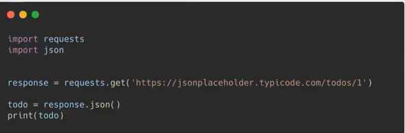
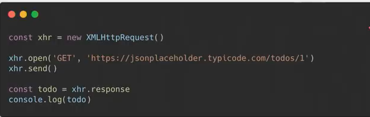
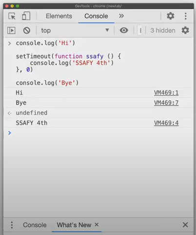
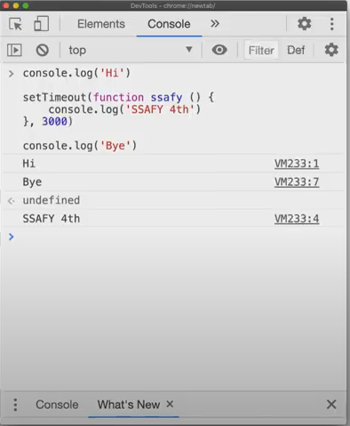
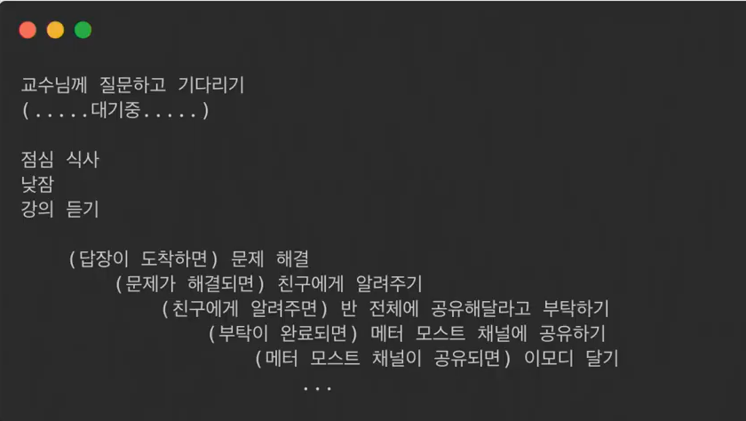
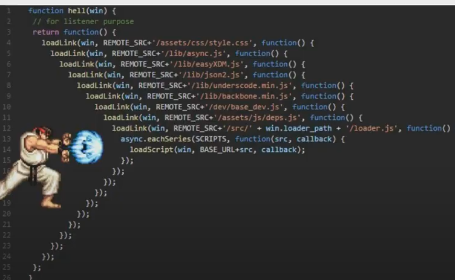
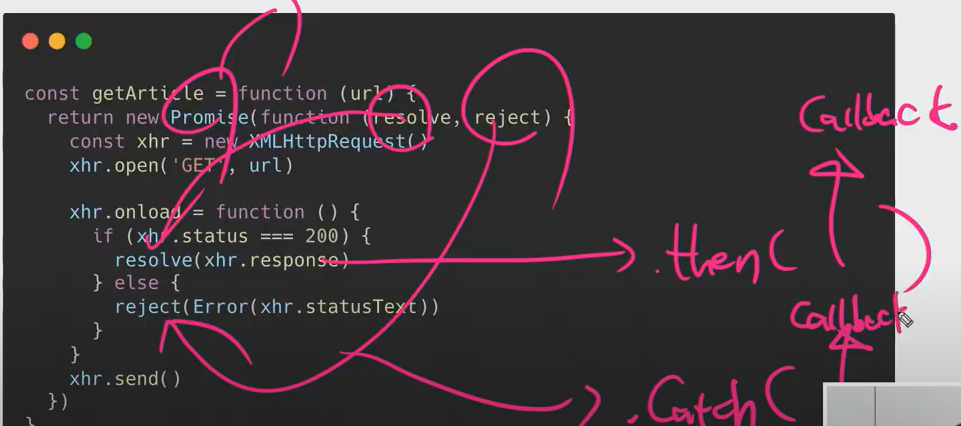
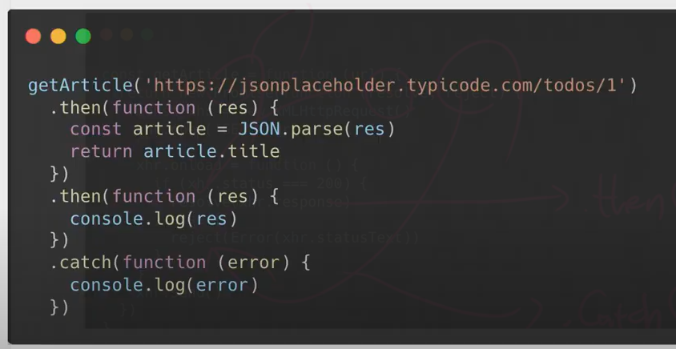
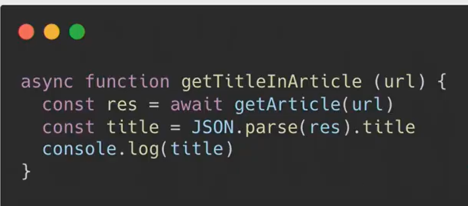
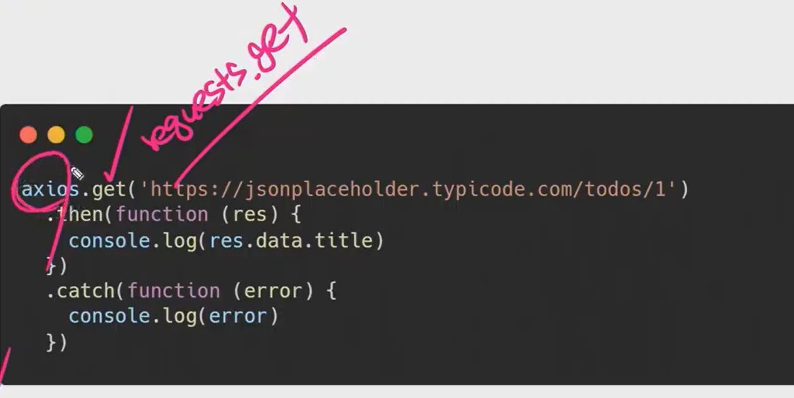

# 01. Javascript (10.14_ 오전)

> EventListener

* Event : 브라우저 안에서 일어나는 일
* click, keydown, submit... 등
* addEventListener : 특정 이벤트가 발생하면 ~ 하자..


--------------

### ECMASCRIPT

* **변수**  : var(안씀, 재할당과 재 선언이 가능해서 의도하지 않은 동작들이 발생함)/` let`: 선언은 한번만, 할당을 자유롭게/`const` 진짜 고정된 값을 사용할 때 선언, 할당 한번만 가능 + **hoistiong(선언을 최 상단으로 끌어 올리는 것)**

* **타입과 연산자** : null, undefined > 엄밀하게 구분한다기 보다 null 은 개발자가 의도적으로 비어있는 값을 표현할 때, undefined는 값이 비어있을 때

* **조건&반복**: block이라고 하는 `{}` 문법으로 사용. switch , if, for.....

* **함수**: **선언**을 하는 방식과 **표현**을 하는 방식으로 나뉨. hoisting에서 차이가 남. 변수에 담길 수 있는 특징을 지닌다.

* **자료구조**:

  * **Array** : list 같은 요소들. **Array Helper Method**(forEach,map, some, reduce,every, filter, finde...) >언제 어떻게 사용하는지에 맞춰서 공부하기.
  * **Object**: 대표적으로 Json  속성에 접근하는 방법, object 축약 문법 (key, value가 같다면 한 번만 사용 가능.)

  

-----------------------------------

#### ASI(Automatic Semicolon Insertion)

> `;` 알아서 자동으로 찍어주는 것. 문장의 마침표 같은 역할을 함. 당장의 중요한 의미를 갖지는 않음. `;`을 찍을 때와 찍지 않을 때를 구분하는 것은 나중의 문제. 일단 찍지 않고 넘어감


-------------

### Coding Style Guide

* **PEP-8**  
* 어떻게 코딩을 해나갈 것인가.. 코딩 스타일은 각 기업별로 다 다르게 가지고 있음. 자체적으로 코딩 스타일 가이드를 가지고 있음.
* **JavaScript Standard Style** --- https://standardjs.com/rules-kokr.html
  * 들여쓰기 2칸 공백
  * 함수 선언 괄호 앞에 공백을 추가한다. `function name (arg)` 
  * 항상 `==` (동등 연산자)대신 `===`(일치 연산자) 를 사용한자. 엄격한 평가를 하느냐의 차이. 
  * `else` 문은 중괄화와 같은 줄에 두어야 한다.
* Keyword 기반으로 사용할 때 찾아서 사용하기.


---------------------------------------------

### AJAX

> **Ajax**  (Asynchronous JavaScript And XML) 
>
> 기본적으로 django에서 client가 좋아요 요청을 날리면 응답으로 server에서 reload가 되면서 하트가 날라 온다. 좋아요를 다시 눌렀을 때 (request가 날라갔을 때) *문서가 reload 되지 않는 것*. 오늘은 이 것이 포인트.

* 요즘은 XML보다 JSON을 더 많이 사용함.
* 서버와 통신하기 위해 XMLRequest 객체를 사용하는 것을 뜻함. 
* 강력한 특징은 페이지 전체를 리프레쉬 하지 않고도 수행할 수 있는 **"비동기성"**이다.
  * **페이지 새로고침 없이 서버에 요청**
  * **서버로부터 데이터를 받고 작업을 수행**
* 어디서 활용 가능할까 ? >>  ex)`google map`  개발작 도구 열고 zoom 하면 xhr이라는 것이 계속 움직임


#### XMLHttpREquest

* 서버와 상호작용 하기 위해 사용됨. 전체 페이지에서 새로고침 없이 URL로부터 데이터를 받아올 수 있음. **사용자가 하고 있는 것을 방해하지 않으면서 페이지 일부를 업데이트 할 수 있다.**

* AJAX 프로그래밍에 사용된다.


#### Asynchronous_(How Javascript works)

* **Asynchronous** (비동기)

  * 
    * 결과: 정상적으로 나옴 
  * 
    * 결과: 빈문자열

  * **왜??** :  **single Tread**

* **Single Thread** (왜? 기다려주지 않아?)

  * **"기다려주지 않는"** 위의 경우에는 서버에서 응답할 때까지 기다려주지만, 밑의 코드는 **기다려주지 않는다!!**
  * **왜??** : 한 번에 하나의 일만 혼자 할 수 있다. 혼자서 일하기 때문이지!!

* **Event Loop** (그렇다면 어떻게 일을 하나요?)

   

  * `0`을 `3000(ms)`으로 바꾸면, 3초 뒤에 출력하는 것.  'HI' > 3초 뒤 'SSAFYth ' > 'Bye'가 나올 것 같다
  * 그러나 실제 결과는 위와 같이 'SSAFY 4th'가 맨 마지막으로 나온다.
  * `0`초로 바꾸어도 결과는 같다. 내부적으로 **어떠한 방식**으로 동작하기 때문.

  -----------------

  **<혼자 일하긴 하지만 도와주는 친구들이 있어!!>**

  * **Call Stack** : 먼저 드러오면 먼저 나가는 구조, 함수 호출을 기록
  * **Web API** : 브라우저 영역에서 제공하는 API
  * **Task Queue** : 콜백 함수가 대기하는 Queue 형태의 자료 구조
  * **Event Loop**:  Call Stack에 현재 실행중인 Task가 없는지 확인하고 Task Queue에 Task가 있는지 확인. 
  *  **call Stack에 쌓임 > pop됨 > Stack (setTime)은 WebApi로 감 (얘한테 맡기고) 다음줄 실행 > 'bye'가 실행되고 output 찍힘 > Task Queue로 이동(setTime)> Task Queue에 있는 아이를 다시 Call Stack으로 밀어 넣음 > 실행함.**

* **기다려주면 안될까...?** 

  ```markdown
  한 페이지 안에서 click을 해서 요청을 날릴 때를 생각해보자. 요청을 하면 응답이 온다. 이 응답이 1초,,2초,,, 1시간,, 2시간,, 걸릴지 예상 가능할까? 알 수 없다. 통제권이 요청하는 client에게 없고 server에 달려있기 때문이다. 응답을 오는 시간을 1시간이 걸린다고 생각해보자. 기다려주지 않는 동기적 방식으로 작용한다고 하자. 그렇다면 우리가 현재 있는 페이지에서 다른 이벤트들이 처리가 가능할까? 그렇지 않기 때문에 **비동기적으로 작동** 하게 된 것이다.
  ```

  

-------------------------------------

### Callback Function

> **Callback Function**

* 인자로 넘어가는 함수

* **특징**

  * return 값으로 함수를 넘길 수 있다..
  * 변수에 담을 수 있다.
  * 인자로 넘길 수 있다.

* python map함수, js map 메서드, django urls.py(path), addEventListener 등 계속 callback function을 사용해 왔다.

  


------------------------------

### Promise

1. **sync**: 해당 일이 처리될 때 까지 기다린다.
2. **async** : 마냥 기다리지 않고 다른 일을 한다. > 답장이 도착하면 문제 해결 > 친구에게 알려준다. ~하면~한다(언제 완료될 지 모르기 때문에)
3. **Callback Function** ~하면 ~하고 또 ~하면 ~하고.... 이와 같은 방식으로 동작한다.



4. **Callback Hell**

   

코드가 엄청 길어지고.. 디버깅 하기 힘들어진다..

그래서 등장한 것이..


#### Promise

> "약속" 이라는 뜻 무엇을? ES6 부터 약속을 하기 시작함. 실패와 성공 시나리오를 작성하여 작동시킴

* promise 객체는 비동기 작업이 맞이할 미래의 완료 또는 실패와 그 결과 값을 나타냄.
* 비동기 작업의 최종 완료 또는 실패를 나타내는 객채이다.

* `.then()`: 성공하면,  (callback)을 하겠다..
* `.catch()`: 실패하면, (callback)을 하겠다.. (에러가 나면 잡아!)
* 위 두 가지 상황을 약속 해 놓고, 진행하겠다는 것!



	* resolve, reject에 대한 시나리오를 써 놓고 진행 하겠다... 이런 flow




-------------

##### **async & await (ES8+)**

> syntactic Sugar

* 문법이 어려워, 복잡해.. 그래서 사용률이 떨어짐

* 문법적으로 사용하기 쉽게 만들어 놓음 

* 내부적인 동작은 그대로 가지만 사용자 입장에서는 쉽게 사용할 수 있게 한 것

* promise 베이스는 맞지만 조금 더 cleaner한 스타일. `.then`,`.then`,`.then` ....chaining이 복잡해짐.

* 그래서 **async & await**이 깔끔하고 복잡하지 않게 볼 수 있게 도와 주는 것.

* **동기적으로 코드를 짤 수 있어서 사용** 아래와 같이  동기적으로 보이게 코드를 짤 수 있다. 

  ​	


--------------------

#### 정리

callback 형식으로 코드를 짤 수 밖에 없는데, 그렇게 되면 callback hell (꼬리에 꼬리를 물고..) 이것을 탈출하기 위한 것이 promise(성공과 실패를 약속하고 가는 것) 성공 하면 `.then`으로 , 실패하면 , `.catch`로 callback하기로 약속. promise의 chaining의 복잡성을 해결하기 위해 `async & await` 이 등장하고 사용.

**Axios** : python의 request와 비슷한 역할을 한다. 요청을 할 때 쓰는 라이브러리

 - 편하게 직관적으로 요청을 보내자. ==> promise based 요청을 보냄 ( 오후 수업에 사용 될  예정.)



