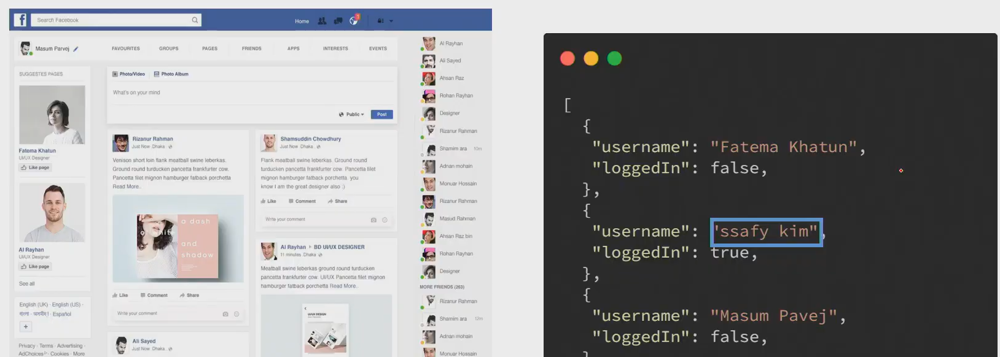
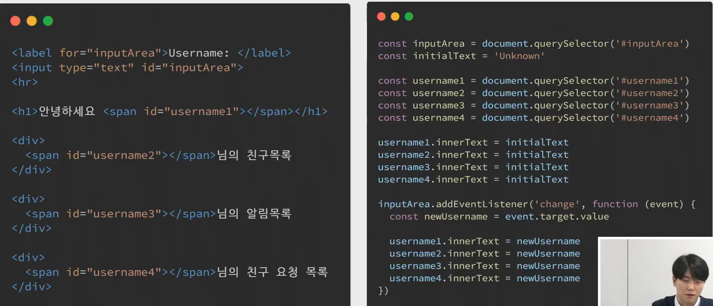
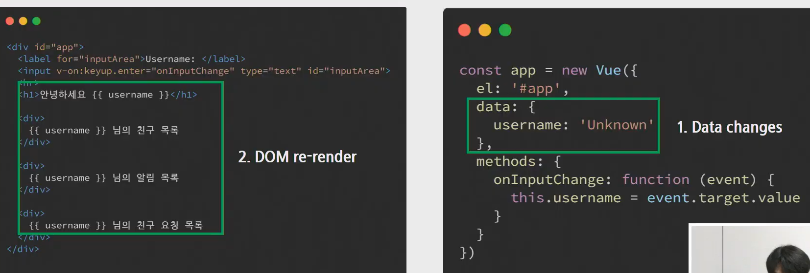
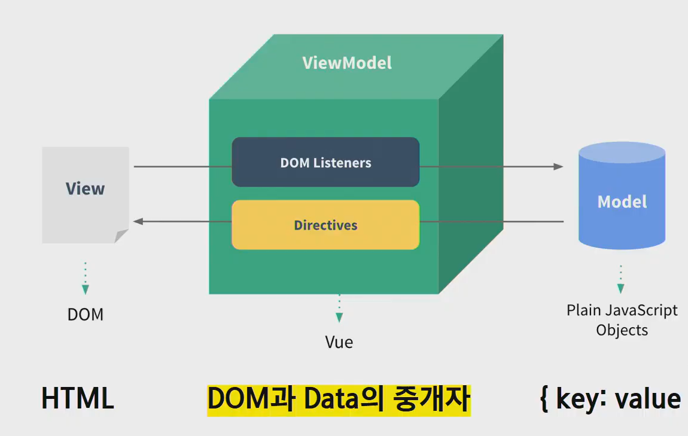

### 핵심요약

> **DRF**

* API 
  * DRF
* RESTful API
  * 자원(URL), 행위(HTTP Method), 표현
  * HTTP Method - GET, PUT, POST, DELETE
* JSON
  * JavaScript Object Notation

> **JavaScript 기초**

* DOM(Document Object Model)
  * DOM Tree
  * DOM Manipulation
* EventListener
  * Event
  * addEventListener(*type, listener*)

> **JavaScript 심화**

* ECMAScript
  * 프로그래밍 언어
* AJAX(XHR)
  * 비동기(요청)
* Callback Function
* Promise
  * .then & .catch / async & await
  * Axios

-------------------------------------------------

## Vue.js

> 사용자 인터페이스를 만들기 위한 프로그레시브 프레임워크

* CSR(Client Side Rendering) -- Django

* SPA(Single Page Application) 

* 결국에는 사용자 경험향상을 위해서 하는 것

* 왜 자바스크립트로만 해도 되는데... ?  => js : 어떠한 대상을 잡고 이벤트를 등록하는 방식으로 작성했다. 

* **Reactive** : 페이스북, 인스타 등등 Data가 정말 많다..한 페이지 안에 무수하게 많은 데이터들이 존재한다.

  나누어진 구역 안에서 username을 바꾸었을 때 모든 부분에 해당하는 데이터가 바뀌어야하는 불편함이 존재한다. js로 구현한다면 ...

이와 같은 방식으로 다 바꿔줘야 할 것이다.  vue를 사용한다면...?

데이터가 바뀌면 DOM이 알아서 랜더링이 자동적으로 된다. 데이터의 변화상만 잘 추적하면 된다. 가장 효과적인 개발 효율의 향상이 목적이다.

* **MVVM** : Model /  View / View Model
* Model : Vue에서 Model은 Javascript Object다.
* View : Vue 에서 View는 DOM(HTML) 실제로 보여지는 것. 장고와는 다름(장고는 중간에 이어주는 애) 
* View Model : Vue 에서 View Model 은 모델과 view를 연결시켜준다. 모든 vue Instance이다.

* 작성 순서
  * Django : url > view > template
  * Vue : data > DOM

  

------------

* **vscode > extension > vetur(단축키, 자동완성)** 설치 진행, dev tools설치

----------

##### Vue.js

1. 빈 html 만들기 +CDN추가
2. 필요한 데이터 정의 및 바인딩
3. 필요한 메서드 정의 및 바인딩